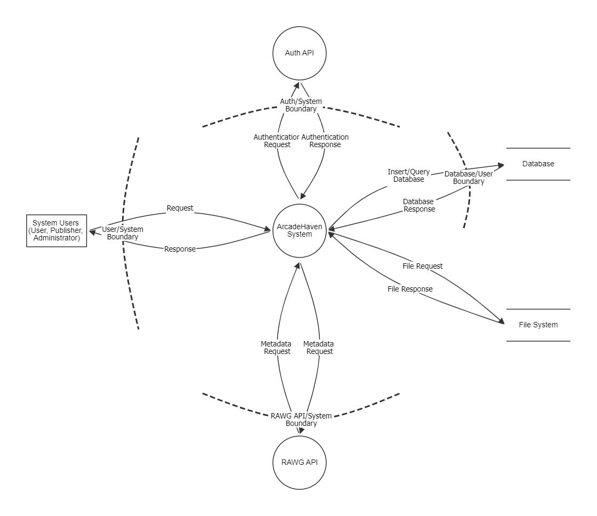
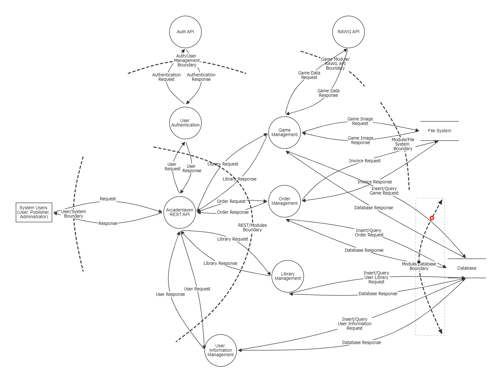
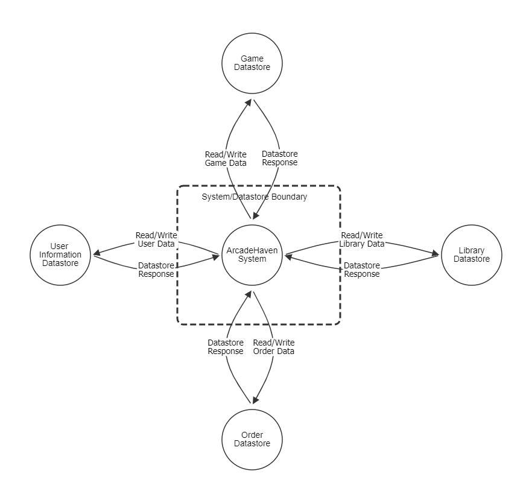
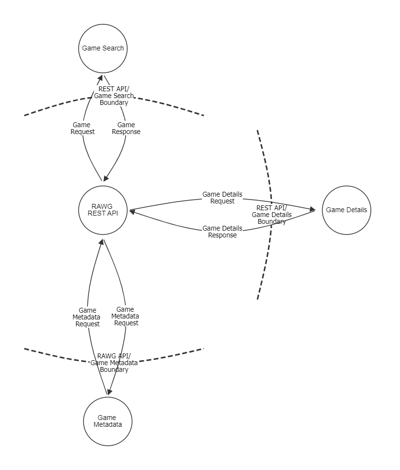
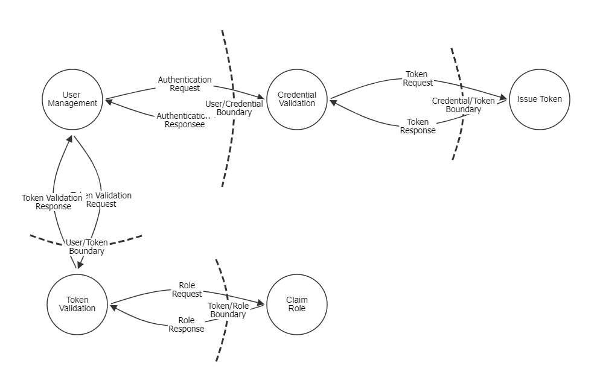
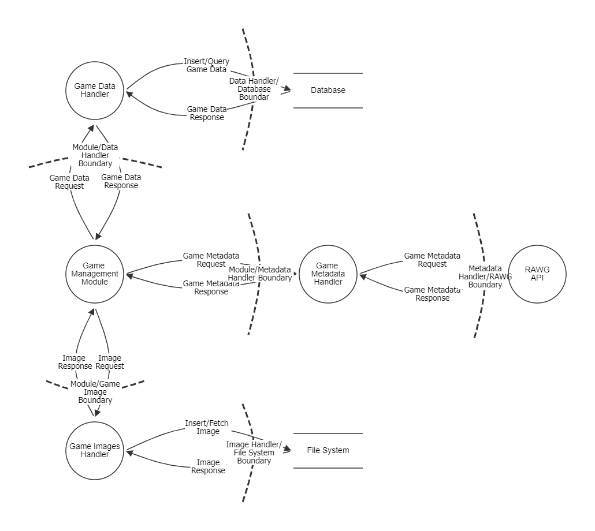

## **1. Documento Objective**

Data Flow Diagrams allow the design team to model the system from a data-centric perspective, focusing on how information is processed, stored, and transferred between different components. The system is represented at multiple levels of abstraction, enabling both a high-level overview and a more detailed decomposition of processes. The levels are defined as follows:
- **Level 0:** (Context Diagram): Represents the system as a single process and shows its interaction with external actors.
- **Level 1:** Decomposes the system into its main processes and illustrates the primary data flows between them.
- **Level 2:** Provides a more detailed breakdown of selected processes, showing internal data transformations and interactions with data stores.

## **2. Dataflow Diagrams**

### **2.1 Level 0**

#### **2.1.1 Context**

---

### **2.2 Level 1**

#### **2.2.1 ArcadeHaven System**

#### **2.2.2 Database**

#### **2.2.3 RAWG API**

#### **2.2.4 AUTH API**

---

### **2.3 Level 2**

#### **2.3.1 Game Management**

