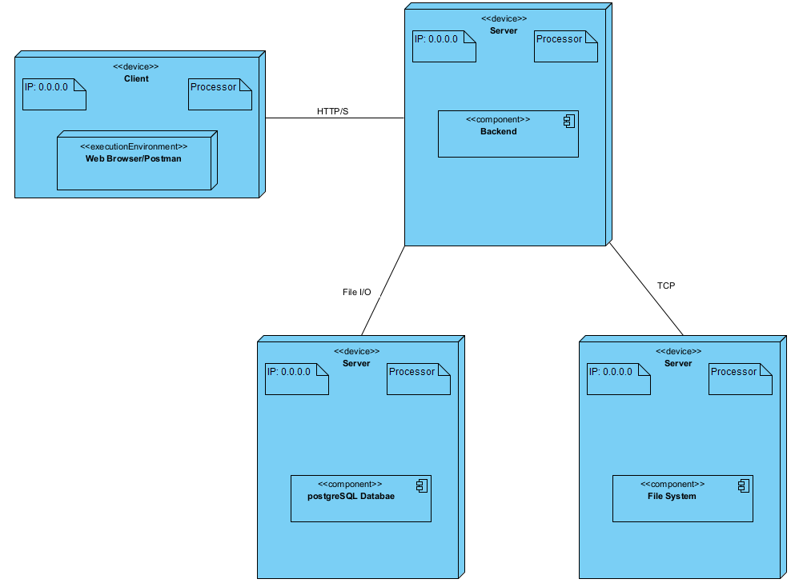

## **1. Documento Objective**

### **1.1 Purpose**

The system architecture will be documented using a combination of the C4 model and the 4+1 view model.

The C4 model allows the design team to represent the system at four levels of detail, from broad to fine-grained: system, container, component and code.
The 4+1 view model allows the system to be analyzed from multiple complementary views, allowing the team to explore the requirements based on the different stakeholders of the software. The views are defined as follow:
- Logical View: focuses on software aspects as to meet the business requirements.
- Process View: focuses on processes workflows and interactions within the system.
- Development View: focuses on the organization of the software in the development environment.
- Physical View: focuses on mapping software components to hardware.
- Scenarios View: focuses on the business processes and how they will be executed by the users.

Taking into account that the implementation of this system is out of scope for the current phase, neither the process, scenarios views or views of level 4 will be represented in the following diagrams.

### **1.2 Reference**

The documentation of the **System Architecture View** follows the *Software Architecture Documentation (SAD) template*, SEI Wiki – [https://wiki.sei.cmu.edu/confluence/display/SAD/Views](https://wiki.sei.cmu.edu/confluence/display/SAD/Views) by **Todd Waits**

## **2. Architectural View**

### **2.1 Level 1 – System**

#### **2.1.1 Logical View**

#### **2.1.2 Development View**

  

#### **2.1.3 Physical View** 

 

---

### **2.2 Level 2 – Container**

#### **2.1.2 Development View**

#### **2.2.2 Development View**

  

#### **2.1.3 Physical View** 

 

---

### **2.3 Level 3 – Component**

#### **2.1.3 Development View**

