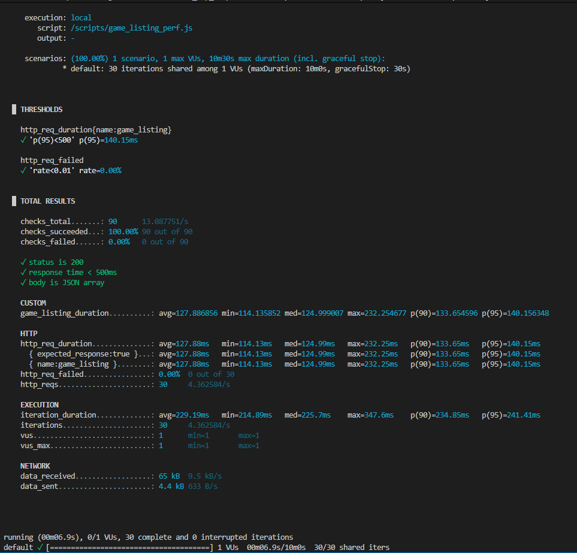
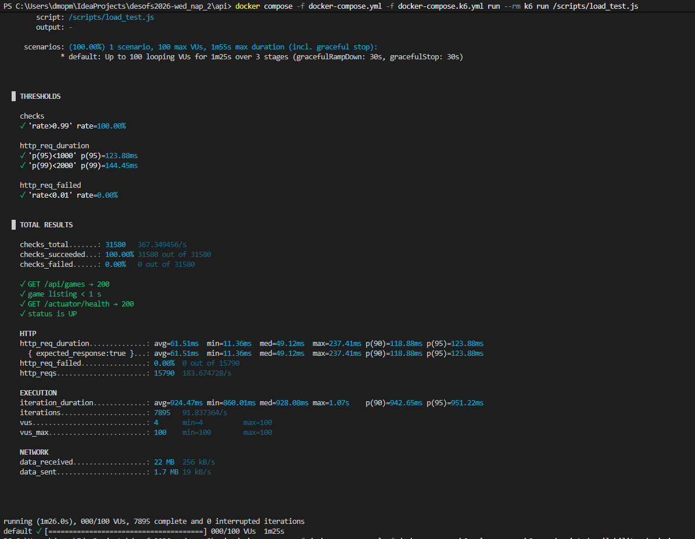
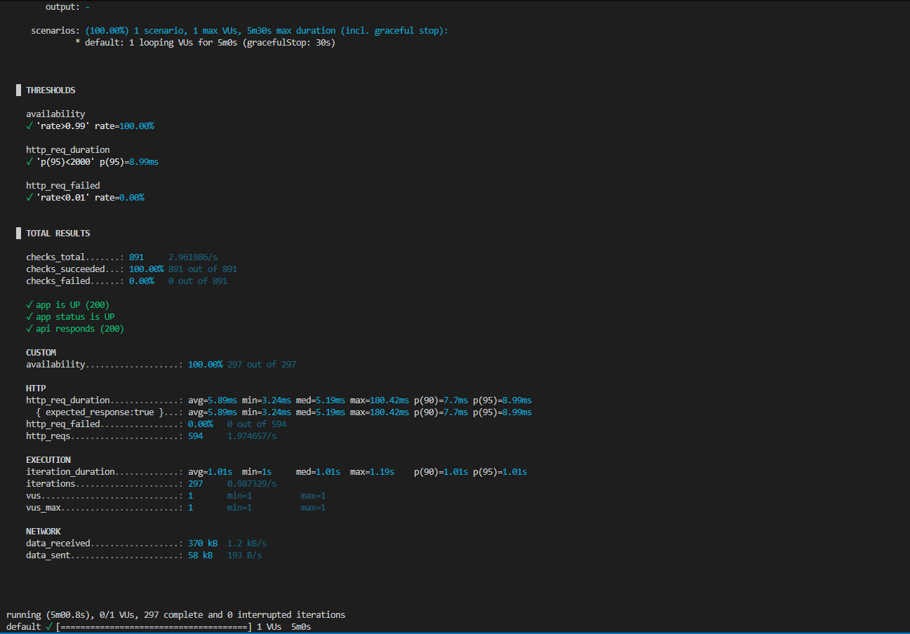

# k6 Load Testing Report — ArcadeHaven API

**Project:** ArcadeHaven  
**Date:** 2026-06-16  
**Tool:** [Grafana k6](https://k6.io/) (Docker-based execution)  
**Stack:** nginx (TLS reverse proxy) → Spring Boot 3 → PostgreSQL

---

## Overview

Three k6 scripts were executed against the live Docker Compose stack to validate the non-functional requirements related to performance and availability. All tests target `https://nginx` from inside the Docker network (`app-services`), accepting the self-signed development certificate via `insecureSkipTLSVerify: true`.

| Test | Script | RNF | Result |
|------|--------|-----|--------|
| Game listing response time | `game_listing_perf.js` | RNF-23 | ✅ PASS |
| Concurrent load (100 VUs) | `load_test.js` | RNF-24 | ✅ PASS |
| Availability monitoring | `availability_check.js` | RNF-26 | ✅ PASS |

---

## Test 1 — Game Listing Response Time (RNF-23)

**Script:** `Api/k6/game_listing_perf.js`  
**Requirement:** `GET /api/games` must respond in under 500 ms at the 95th percentile.

**Scenario:** 1 virtual user executing 30 sequential iterations against `GET /api/games`.

**Command used:**
```bash
docker compose -f docker-compose.yml -f docker-compose.k6.yml run --rm k6 run /scripts/game_listing_perf.js
```

### Thresholds

| Threshold | Condition | Result | Value |
|-----------|-----------|--------|-------|
| `http_req_duration{name:game_listing}` | p(95) < 500 ms | ✅ PASS | **140.15 ms** |
| `http_req_failed` | rate < 1% | ✅ PASS | **0.00%** |

### Results Summary

| Metric | Value |
|--------|-------|
| Checks total | 90 |
| Checks succeeded | 100.00% (90/90) |
| Checks failed | 0.00% (0/90) |
| Requests total | 30 |
| Request failure rate | 0.00% |
| Iterations | 30 |
| Duration | ~6.9 s |

### Response Time Distribution (`http_req_duration`)

| avg | min | median | max | p(90) | p(95) |
|-----|-----|--------|-----|-------|-------|
| 127.88 ms | 114.13 ms | 124.99 ms | 232.25 ms | 133.65 ms | **140.15 ms** |

### Checks Passed

- ✅ `status is 200`
- ✅ `response time < 500ms`
- ✅ `body is JSON array`

### Network

| Metric | Value |
|--------|-------|
| Data received | 65 kB (9.5 kB/s) |
| Data sent | 4.4 kB (633 B/s) |

### Evidence



### Conclusion

RNF-23 is **satisfied**. The p95 latency of **140 ms** is well below the 500 ms threshold. No request failures were observed across all 30 iterations.

---

## Test 2 — Concurrent Load Test (RNF-24)

**Script:** `Api/k6/load_test.js`  
**Requirement:** The system must sustain 100+ concurrent users with an error rate below 1% and a p95 response time below 1000 ms.

**Scenario:**
- Ramp up to 100 VUs over 15 s
- Hold 100 VUs for 60 s
- Ramp down over 10 s

Each iteration sends two requests: `GET /api/games` and `GET /actuator/health`.

**Command used:**
```bash
docker compose -f docker-compose.yml -f docker-compose.k6.yml run --rm k6 run /scripts/load_test.js
```

### Thresholds

| Threshold | Condition | Result | Value |
|-----------|-----------|--------|-------|
| `checks` | rate > 99% | ✅ PASS | **100.00%** |
| `http_req_duration` | p(95) < 1000 ms | ✅ PASS | **123.88 ms** |
| `http_req_duration` | p(99) < 2000 ms | ✅ PASS | **144.45 ms** |
| `http_req_failed` | rate < 1% | ✅ PASS | **0.00%** |

### Results Summary

| Metric | Value |
|--------|-------|
| Checks total | 31 580 |
| Checks succeeded | 100.00% (31 580/31 580) |
| Checks failed | 0.00% |
| HTTP requests total | 15 790 |
| Request rate | 183.67 req/s |
| Request failure rate | 0.00% |
| Iterations | 7 895 |
| Peak VUs | 100 |
| Total duration | ~1 m 25 s |

### Response Time Distribution (`http_req_duration`)

| avg | min | median | max | p(90) | p(95) | p(99) |
|-----|-----|--------|-----|-------|-------|-------|
| 61.51 ms | 11.36 ms | 49.12 ms | 237.41 ms | 118.88 ms | **123.88 ms** | **144.45 ms** |

### Checks Passed

- ✅ `GET /api/games → 200`
- ✅ `game listing < 1 s`
- ✅ `GET /actuator/health → 200`
- ✅ `status is UP`

### Network

| Metric | Value |
|--------|-------|
| Data received | 22 MB (256 kB/s) |
| Data sent | 1.7 MB (19 kB/s) |

### Evidence



### Conclusion

RNF-24 is **satisfied**. Under a sustained load of 100 concurrent virtual users for 60 s, the API returned a p95 of **123.88 ms** and a p99 of **144.45 ms** — both well below the required thresholds of 1000 ms and 2000 ms respectively. Zero requests failed across 15 790 HTTP calls.

---

## Test 3 — Availability Monitoring (RNF-26)

**Script:** `Api/k6/availability_check.js`  
**Requirement:** System availability must be ≥ 99% over a continuous monitoring window of 5 minutes.

**Scenario:** 1 VU sends one request per second to both `/actuator/health` and `/api/games` for 5 minutes (~300 iterations). A failed or timed-out request counts as unavailability.

**Command used:**
```bash
docker compose -f docker-compose.yml -f docker-compose.k6.yml run --rm k6 run /scripts/availability_check.js
```

### Thresholds

| Threshold | Condition | Result | Value |
|-----------|-----------|--------|-------|
| `availability` | rate > 99% | ✅ PASS | **100.00%** |
| `http_req_failed` | rate < 1% | ✅ PASS | **0.00%** |
| `http_req_duration` | p(95) < 2000 ms | ✅ PASS | **8.99 ms** |

### Results Summary

| Metric | Value |
|--------|-------|
| Checks total | 891 |
| Checks succeeded | 100.00% (891/891) |
| Checks failed | 0.00% (0/891) |
| HTTP requests total | 594 |
| Request failure rate | 0.00% (0/594) |
| Request rate | 1.97 req/s |
| Iterations | 297 |
| Duration | 5m 0.8s |

### Availability

| Metric | Value |
|--------|-------|
| availability (custom rate) | **100.00%** (297/297) |

### Response Time Distribution (`http_req_duration`)

| avg | min | median | max | p(90) | p(95) |
|-----|-----|--------|-----|-------|-------|
| 5.89 ms | 3.24 ms | 5.19 ms | 180.42 ms | 7.7 ms | **8.99 ms** |

### Checks Passed

- ✅ `app is UP (200)`
- ✅ `app status is UP`
- ✅ `api responds (200)`

### Network

| Metric | Value |
|--------|-------|
| Data received | 370 kB (1.2 kB/s) |
| Data sent | 58 kB (193 B/s) |

### Evidence



### Conclusion

RNF-26 is **satisfied**. Over a continuous 5-minute monitoring window of 297 iterations (594 HTTP requests), the system achieved **100% availability** — well above the required 99% threshold. Zero requests failed. The p95 response time was **8.99 ms**, far below the 2000 ms limit. The auto-restart policy and health checks configured in Docker Compose (`restart: unless-stopped`, `healthcheck`) kept the application fully available without any manual intervention.

---

## Environment

| Component | Details |
|-----------|---------|
| k6 image | `grafana/k6:latest` |
| Target | `https://nginx` (internal Docker network `app-services`) |
| TLS | Self-signed dev certificate; `insecureSkipTLSVerify: true` |
| App | `arcadehaven-api:latest` (Spring Boot 3 on port 8080) |
| Reverse proxy | `nginx:1.27-alpine` (TLS termination on port 443) |
| OS / Host | Windows 11, Docker Desktop |
