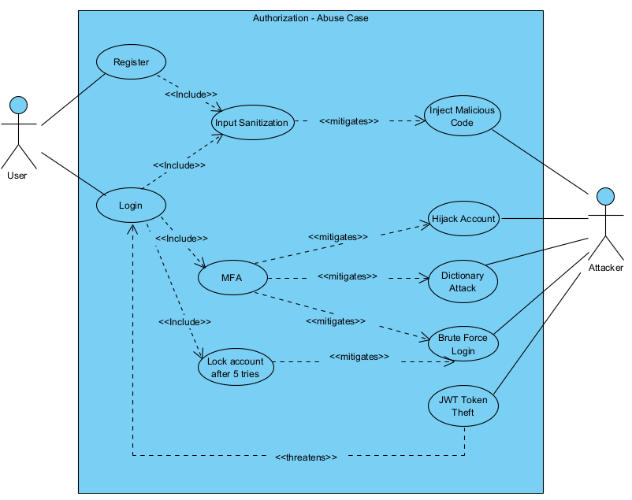
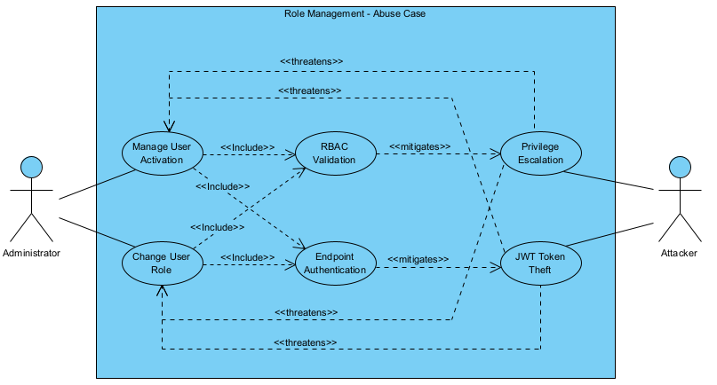
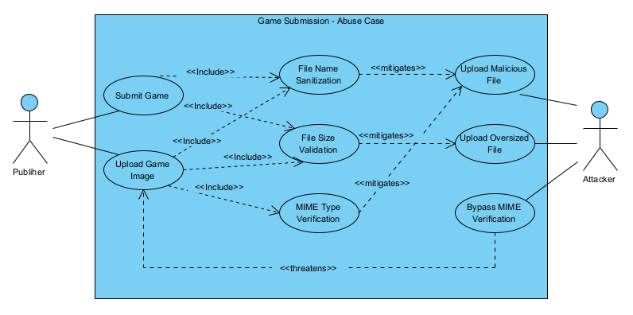
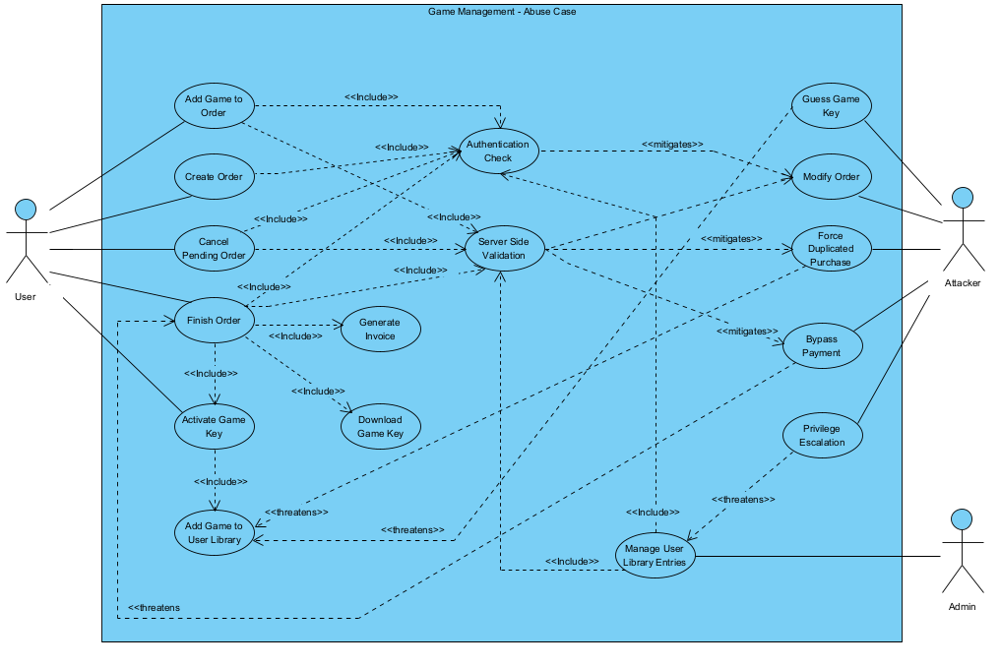
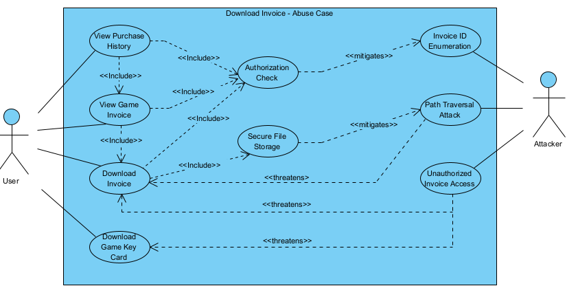

# Abuse Cases

## 1. Purpose and Scope

This document presents all considered abuse cases for the **ArcadeHaven** system, taking into account all the affected actors, use cases, mitigations and threaths.

## 2. Designed Abuse Cases

### [Authorization Abuse Case](./authorization-abuse-case.puml)

---

### [Role Management Abuse Case](./role-management-abuse-case.puml)

---

### [Game Submission Abuse Case](./game-submission-abuse-case.puml)

---

### [Game Management Abuse Case](./game-management-abuse-case.puml)

---

### [Download Invoice Abuse Case](./download-invoice-abuse-case.puml)

## 3. Abuse Cases Catalog

| Abuse Case ID | Name                        | Description | Mitigations | Threatens | File |
| --------------| --------------------------- | ----------- | ----------- | --------- | -----|
| AC-01         | Inject Malicious Code       | An attacker submits specially crafted input (e.g., scripts or malformed data) to exploit vulnerabilities in the system, potentially leading to unauthorized data access or system compromise. | Input Sanitization | | [Authorization](./authorization-abuse-case.puml) |
| AC-02         | Hijack Account              | An attacker gains control of a legitimate user’s account, typically through stolen credentials or session compromise, allowing unauthorized actions under that user’s identity. | MFA | | [Authorization](./authorization-abuse-case.puml) |
| AC-03         | Dictionary Attack           | An attacker attempts to log in by systematically trying a list of commonly used passwords, exploiting weak password choices. | MFA | | [Authorization](./authorization-abuse-case.puml) |
| AC-04         | Brute Force Login           | An attacker repeatedly attempts different password combinations to gain access to a user account. | MFA | | [Authorization](./authorization-abuse-case.puml) | 
| AC-05         | JWT Token Theft             | An attacker steals a valid JWT token and uses it to impersonate a legitimate user without needing their credentials. | MFA, Lock Account After 5 Tries | Login | [Authorization](./authorization-abuse-case.puml) | 
| AC-06 (A-BC)  | Privilege Escalation        | An attacker exploits weaknesses in authorization controls to gain higher privileges than intended, such as accessing admin-only functionalities. | RBAC Validation | Manage User Activation, Change User Role | [Role Management](./role-management-abuse-case.puml) |
| AC-06 (G-MAC) | Privilege Escalation        | An attacker gains unauthorized access to restricted operations within the game management context, bypassing role restrictions. | | Manage User Library Entries | [Game Managemnet](./game-management-abuse-case.puml) |
| AC-07         | JWT Token Theft             | An attacker reuses or steals a JWT token to perform unauthorized actions within protected system operations. | Endpoint Authentication | Manage User Activation, Change User Role | [Role Management](./role-management-abuse-case.puml) |
| AC-08         | Upload Malicious File       | An attacker uploads a harmful file disguised as a valid resource, potentially compromising the system or other users. | File Name Sanitization | | [Game Submission](./game-submission-abuse-case.puml) |
| AC-09         | Upload Oversized File       | An attacker uploads excessively large files to exhaust system resources, leading to degraded performance or denial of service. | File Size Validation | | [Game Submission](./game-submission-abuse-case.puml) |
| AC-10         | Bypasse MIME-Verification   | An attacker circumvents file type validation mechanisms to upload files with dangerous content disguised as safe formats. | | Upload Game Image | [Game Submission](./game-submission-abuse-case.puml) |
| AC-11         | Guess Game Key              | An attacker attempts to guess valid activation keys to gain unauthorized access to games without purchasing them. | | Add Game to User Library | [Game Managemnet](./game-management-abuse-case.puml) |
| AC-12         | Modify Order                | An attacker manipulates order data (e.g., prices or items) to gain financial advantage or bypass system restrictions. | Authentication Check, Server Side Validation | | [Game Managemnet](./game-management-abuse-case.puml) |
| AC-13         | Force Duplicated Purchase   | An attacker exploits system logic to purchase the same game multiple times or bypass duplicate purchase restrictions. | Authentication Check, Server Side Validation | | [Game Managemnet](./game-management-abuse-case.puml) |
| AC-14         | Bypass Payment              | An attacker attempts to complete an order without proper payment validation, obtaining products for free. | Server Side Validation | Finih Order | [Game Managemnet](./game-management-abuse-case.puml) |
| AC-15         | Invoice ID Enumeration      | An attacker systematically tries different invoice identifiers to access invoices belonging to other users. | Authorization Check | | [Download Invoice](./download-invoice-abuse-case.puml) |
| AC-16         | Path Traversal Attack       | An attacker manipulates file paths to access files outside the intended directory, potentially exposing sensitive system data. | Secure File Storage | Download Invoice | [Download Invoice](./download-invoice-abuse-case.puml) |
| AC-17         | Unauthorized Invoice Access | An attacker gains access to invoice files without proper authorization, exposing sensitive financial or user information. | | Download Invoice, Download Game Key Card | [Download Invoice](./download-invoice-abuse-case.puml) |

---

### Summary

We found a total of 17 abuse cases, distributed as follows:

| Type                       | Generic Description                               | Total |
| -------------------------- | ------------------------------------------------- | ----- |
| Authentication             | Attacks targeting login and session security      | 5     |
| Authorization              | Attacks targeting access control and roles        | 3     |
| File Upload                | Attacks targeting file validation and uploads     | 3     |
| Orders and Game Management | Attacks targeting business logic and transactions | 4     |
| File Access                | Attacks targeting file retrieval and storage      | 2     |
